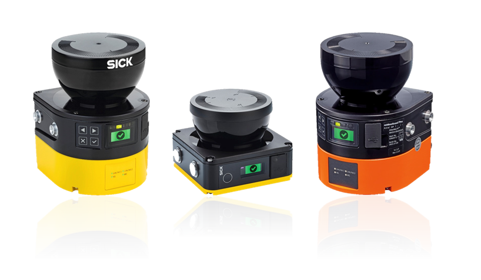

# Sick_Safetyscanners ROS2 Driver

A ROS2 Driver which reads the raw data from the SICK Safety Scanners and publishes the data as a laser_scan msg.

The ROS1 Driver can be found here: https://github.com/SICKAG/sick_safetyscanners

## Table of contents

- [Supported Hardware](#supported-hardware)
- [Getting started](#getting-started)
- [ROS API](#ros-api)
- [Creators](#creators)


## Supported Hardware

Supported are all microScan3, nanoScan3 and outdoorScan3 variants with Ethernet connection.




## Getting started
In the future the ROS2 driver will be released as a debian package, currently only build from source
is supported.

### Prerequisites

* Linux
* Working ROS-Distro
* Correctly setup SICK Safety Scanner
* Connected SICK Safety Scanner and a correctly setup ethernet network. Both the host and the sensor have to be in the same network.

### Installation

#### Dependencies

Dependencies can be installed via 
```
sudo apt-get install ros-<rosdistro>-sick-safetyscanners2-interfaces
sudo apt-get install ros-<rosdistro>-sick-safetyscanners-base
```

The sources can be found here:
* sick_safetyscanners_base (https://github.com/SICKAG/sick_safetyscanners_base)
* sick_safetyscanners2_interfaces (https://github.com/SICKAG/sick_safetyscanners2_interfaces)


#### From Source

```bash
source /opt/ros/<rosdistro>/setup.bash
mkdir -p ~/colcon_ws/src/
cd ~/colcon_ws/src/
git clone https://github.com/SICKAG/sick_safetyscanners2.git
cd ..
colcon build --symlink-install
source ~/colcon_ws/install/setup.sh
```

### Starting

#### Classic Node

To start the driver the launch file has to be started. For the driver to work correctly, the sensor ip and host ip have to be defined. These parameters can be passed to the sensor as arguments via launch file.

```
ros2 launch sick_safetyscanners2 sick_safetyscanners2_launch.py
```

This will start the driver with the in launch file defined parameters.

#### Lifecycle Node

To start the driver within a lifecycle the launch file has to be started. For the driver to work correctly, the sensor ip and host ip have to be defined. These parameters can be passed to the sensor as arguments via launch file.

```
ros2 launch sick_safetyscanners2 sick_safetyscanners2_lifecycle_launch.py
```

This will start the driver with the in launch file defined parameters.

To configure and activate the lifecycle node the following commands have to be issued:
```
// Configure
ros2 lifecycle set /sick_safetyscanners2_lifecycle_node configure

//Activate
ros2 lifecycle set /sick_safetyscanners2_lifecycle_node activate
```


#### Visualization

To visualize the data start rviz2 and subscribe to the ~/scan topic.
By default the frame_id is "scan" however this can be customized in the launch file

```
rviz2
```

### Troubleshooting

* Check if the sensor has power and is connected to the host.
* Check if both sensor and host are in the same subnet e.g. 192.168.1
* Check if the launch file is called with the correct parameters for IP-addresses and ports.

## ROS2 API


### Advertised ROS2 Topics


`
~/scan (type: sensor_msgs/msg/LaserScan)
`

Publishes a scan from the laserscanner

`
~/extended_laser_scan (type: sick_safetyscanners2_interfaces/msg/ExtendedLaserScan)
`

Extends the basic laser scan message by reflector data and intrusion data.

`
~/output_paths (type: sick_safetyscanners2_interfaces/msg/OutputPath)
`

Gives feedback of the current status of the output paths.


`
~/raw_data (type: sick_safetyscanners2_interfaces/msg/RawMicroScanData)
`

Publishes the raw data from the sensor as a ROS2 message.

`
~/diagnostics (type: diagnostic_msgs/msg/DiagnosticArray)
`

Frequency and sensor diagnostics

### Advertised ROS2 Services

`
~/field_data
`

Returns all configured protective and warning fields for the sensor


### ROS2 parameters

| Parameter Name        | Type    | Default      | Required on startup | Information                                                                                                                                                                                                                                |
| -------------         | ------  | -------      | ------------        | -------------                                                                                                                                                                                                                              |
| sensor_ip             | String  | 192.168.1.11 | ✔                   | Sensor IP address. Can be passed as an argument to the launch file.                                                                                                                                                                        |
| host_ip               | String  | 192.168.1.9  | ✔                   | Host IP address.  Can be passed as an argument to the launch file.                                                                                                                                                                         |
| interface_ip          | String  | 0.0.0.0      |                     | Interface IP address of the receiving host computer, this needs to be set if the host IP is in the multicast IP range. The default is an undefined IP address and will return an error when multicast is used without a correct interface. |
| host_udp_port         | Integer | 0            |                     | Host UDP Port.  Can be passed as an argument to the launch file.  Zero allows system chosen port.                                                                                                                                          |
| frame_id              | String  | scan         |                     | The frame name of the sensor message                                                                                                                                                                                                       |
| skip                  | Integer | 0            |                     | The number of scans to skip between each measured scan.  For a 25Hz laser, setting 'skip' to 0 makes it publish at 25Hz, 'skip' to 1 makes it publish at 12.5Hz.                                                                           |
| angle_start           | Double  | 0.0          |                     | Start angle of scan in radians, if both start and end angle are equal, all angels are regarded.  0° is at the front of the scanner.                                                                                                        |
| angle_end             | Double  | 0.0          |                     | End angle of scan in radians, if both start and end angle are equal, all angels are regarded.  0° is at the front of the scanner.                                                                                                          |
| min_intensities       | Double  | 0.0          |                     | If this parameter is set, all points below the one set in the parameter are set to infinity                                                                                                                                                |
| channel_enabled       | Boolean | true         |                     | If the channel should be enabled                                                                                                                                                                                                           |
| general_system_state  | Boolean | true         |                     | If the general system state should be published                                                                                                                                                                                            |
| derived_settings      | Boolean | true         |                     | If the derived settings should be published                                                                                                                                                                                                |
| measurement_data      | Boolean | true         |                     | If the measurement data should be published                                                                                                                                                                                                |
| intrusion_data        | Boolean | true         |                     | If the intrusion data should be published                                                                                                                                                                                                  |
| application_io_data   | Boolean | true         |                     | If the application IO data should be published                                                                                                                                                                                             |
| use_persistent_config | Boolean | false        |                     | If this flag is set, the configured angles from the sensor are loaded and used and the ROS parameters *angle_start* and *angle_end* are disregarded                                                                                        |

## Creators

**Lennart Puck** 

FZI Forschungszentrum Informatik


- <http://www.fzi.de>

on behalf of SICK AG 

- <http://www.sick.com>


